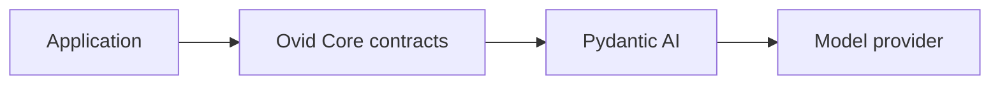

<h1 align="center">Ovid Core</h1>

<p align="center">
  Typed building blocks for Python agent applications.
</p>

<p align="center">
  <a href="https://www.python.org/downloads/"></a>
  <a href="pyproject.toml"></a>
  <a href="https://github.com/EzyGang/ovid-core/actions/workflows/ci.yml"></a>
  <a href="LICENSE"></a>
</p>

---

Ovid Core uses [Pydantic AI](https://ai.pydantic.dev/) for model calls, the agent loop, tools, structured output, streaming, and provider support.

Ovid Core adds stable types for application code. These types cover configuration, messages, results, usage, tools, storage, and transports. Ovid Core does not replace or fork Pydantic AI.

Installing the package does not start a server or add tools to an agent. Your application enables each optional feature.

**Documentation:** [docs/content/index.md](docs/content/index.md)  
**Source:** https://github.com/EzyGang/ovid-core  
**Native tools:** https://github.com/EzyGang/ovid-native

---

## Contents

- [When to use Ovid Core](#when-to-use-ovid-core)
- [Installation](#installation)
- [Quick start](#quick-start)
- [Features](#features)
- [Pydantic AI capabilities](#pydantic-ai-capabilities)
- [Server support](#server-support)
- [Application ownership](#application-ownership)
- [Development](#development)
- [Contributing](#contributing)
- [License](#license)

## When to use Ovid Core

Use Pydantic AI directly when one small process owns the agent and upstream types can stay in that process.

Use Ovid Core when an agent is a shared application component. Workers, services, databases, command-line programs, and user interfaces can use the same agent definition and data contracts.



| Need | Direct Pydantic AI | Ovid Core |
| --- | --- | --- |
| Model selection | Model string or provider object | Names, aliases, routes, and fallbacks |
| Messages and results | Pydantic AI runtime values | Frozen Ovid models |
| Tools | Pydantic AI tools and toolsets | Typed tools, approvals, timeouts, and hooks |
| Usage limits | One upstream run | One budget across parent and child agents |
| Storage | Upstream messages or custom conversion | Normalized messages and a versioned codec |
| Transports | Application-built transport | Optional HTTP, SSE, stdio, and AG-UI adapters |
| Upstream changes | Update each caller | Update the Ovid adapter boundary |

This layer adds structure and another dependency. Do not use it for a small script that does not need shared contracts. Use it when agent data crosses a process, storage, transport, or team boundary.

Read [Why Ovid Core](docs/content/why-ovid-core.md) for a longer comparison.

## Installation

Ovid Core requires Python 3.14 or newer.

With uv:

```bash
uv add ovid-core
```

With pip:

```bash
pip install ovid-core
```

Add native HTTP and SSE support only when needed:

```bash
uv add 'ovid-core[server]'
```

Add AG-UI support with:

```bash
uv add 'ovid-core[server-ag-ui]'
```

## Quick start

The application constructs one final `OvidConfig`. It can parse TOML, JSON, YAML, or another source before validation.

Set the provider key:

```bash
export OPENAI_API_KEY='...'
```

On Windows PowerShell:

```powershell
$env:OPENAI_API_KEY = '...'
```

Create and run an agent:

```python
import asyncio

from ovid_core import AgentDefinition, AgentFactory
from ovid_core.config import OvidConfig
from ovid_core.routing import ModelRef


async def main() -> None:
    config = OvidConfig.model_validate(
        {'models': {'primary': {'provider': 'openai', 'model': 'gpt-5'}}}
    )
    factory = AgentFactory(config=config)
    agent = await factory.build(
        AgentDefinition[None, str](
            model=ModelRef(name='primary'),
            deps_type=type(None),
            output_type=str,
            instructions=('Answer clearly. Do not invent facts.',),
        )
    )

    result = await agent.run('What is 2 + 2?', deps=None)

    print(result.output)
    print(result.usage)
    print(result.run_id)


asyncio.run(main())
```

The result uses Ovid types. It contains the validated output, messages, usage, run ID, and conversation ID.

Read the [getting started guide](docs/content/getting-started.md) for provider keys, routes, streaming, and errors.

## Features

### Configuration and model routes

Give models local names such as `primary` or `fast`. Agent definitions use those names instead of provider strings. Routes can try another model after an eligible provider failure.

### Typed agent definitions

`AgentDefinition[Deps, Output]` sets the model, dependencies, output, instructions, extensions, and run policy. Definitions are immutable.

### Normalized runtime data

Runs return Ovid-owned messages, events, results, usage values, and identifiers. Application code does not need provider response types.

### Tools and capabilities

Add only the tools an agent needs. Capabilities can add instructions, tools, toolsets, model settings, and service requirements. Duplicate IDs are errors.

Each tool supplies a default approval value.
Set `AgentDefinition.tool_approval` when the application must override that value for all Ovid tools.

### Usage and policy

Apply request, token, and tool-call limits to one run or a nested workflow. Run policy also controls retries, timeouts, concurrency, and end behavior.

### Relay and Todo

Relay gives application-owned agents a typed message channel. Todo stores phased work state through a replaceable backend. Applications must enable each capability.

### Storage and transports

Use the conversation store protocol with your database. Optional adapters expose registered agents over HTTP, SSE, stdio, or AG-UI.

## Pydantic AI capabilities

A normal Ovid agent can also use a Pydantic AI or Pydantic AI Harness capability:

```python
from pydantic_ai_harness.planning import Planning

from ovid_core.adapters.pydantic_ai import pydantic_ai_capability
from ovid_native.search import SearchCapability


capabilities = (
    SearchCapability[AppDependencies](),
    pydantic_ai_capability(Planning()),
)
```

The adapter passes the same capability instance to Pydantic AI. Upstream instructions, tools, ordering, deferred loading, run state, and lifecycle hooks keep their normal behavior. A deferred capability needs an explicit ID.

Upstream tools remain Pydantic AI tools. They do not gain Ovid approvals, Ovid hooks, Ovid result validation, service binding, or Ovid timeouts. Test any capability that changes models, messages, events, or durable execution through Ovid's public run and stream APIs.

Use Ovid capability types when you need the complete Ovid contract. See [Tools and capabilities](docs/content/api/extensions.md#pydantic-ai-capability-passthrough) for the boundary details.

## Server support

Ovid Core can expose registered agents, but it is not a full web framework. The application still owns:

- authentication and authorization
- database setup and data retention
- TLS and network policy
- dependency construction
- deployment and process control
- telemetry export

Read [Embed and expose agents](docs/content/guides/embed-agents.md) before adding a transport.

## Application ownership

Ovid Core does not discover configuration files, load application secrets, choose every tool, or create global services. The application passes one final configuration and selects each capability.

Install [ovid-native](https://github.com/EzyGang/ovid-native) for Rust-backed workspace tools. Ovid Core does not depend on it.

## Development

Clone the repository, then run:

```bash
uv sync
uv run task ruff
uv run task ty-lint
uv run task vulture
uv run task tests
uv run task docs-build
uv build
```

Serve the documentation locally with:

```bash
uv run task docs-run
```

Ovid Core requires 100% branch coverage for its Python integration layer.

## Contributing

1. Open an issue for a large change or new public contract.
2. Create a branch from `main`.
3. Add tests for changed behavior.
4. Run the development checks.
5. Open a pull request that explains the reason for the change.

Keep provider runtime types inside adapters. Keep application policy in the application. See [AGENTS.md](AGENTS.md) for all repository rules.

## License

Ovid Core is licensed under the [MIT License](LICENSE).
