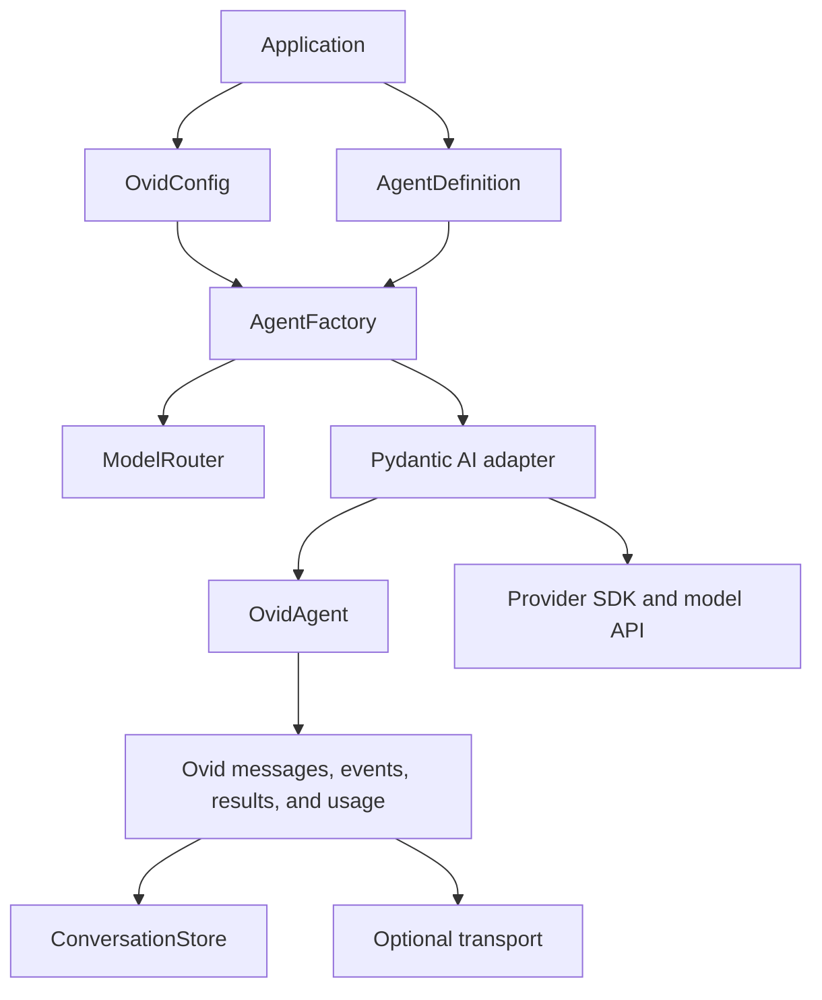
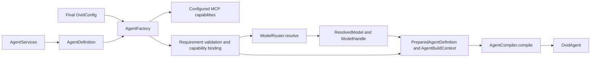
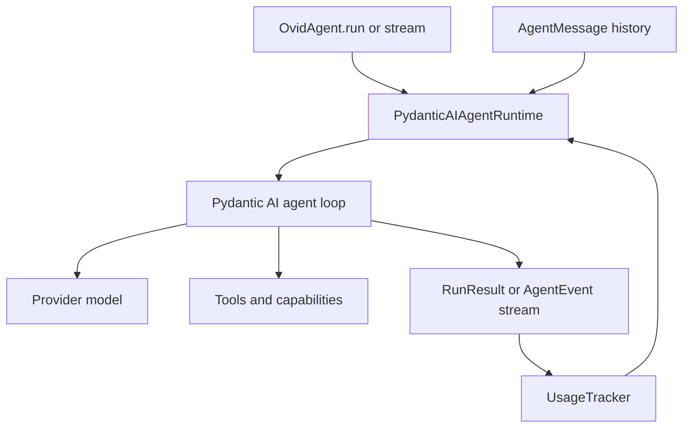

# Architecture

Ovid Core puts domain interfaces around a Pydantic AI adapter.

Domain packages do not import Pydantic AI, Starlette, or provider clients. Adapter packages import Ovid types and third-party types.



## Two operation phases

Ovid Core separates agent construction from agent execution.

This separation makes provider setup, model selection, and extension setup explicit.

## Construction phase



The construction phase has these steps:

1. The application makes one final `OvidConfig`.
2. The application makes one typed `AgentDefinition` with an immutable named service registry.
3. `AgentFactory` constructs configured MCP capabilities.
4. The factory validates every capability service requirement and binds each capability exactly once.
5. The router resolves the selected model, alias, or route.
6. The model factory constructs and caches each model handle.
7. The factory creates a prepared definition and neutral build context.
8. The application can render instructions from the build context.
9. The compiler adapts the prepared extensions and constructs the agent runtime.
10. The factory returns an `OvidAgent`.

`AgentFactory(config=config)` supplies the default model factory, router, and compiler.

The router caches model handles. Run and stream calls can select another configured model without changing the definition.

## Named agent services

`AgentServices` contains immutable `(service key, API version, name)` bindings. A capability publishes inspectable
`AgentServiceRequirement` values and resolves its provider during construction. Missing services, incompatible value
types, missing features, duplicate bindings, and effective tool-name collisions fail before a model call.

Service values remain stateful application-owned objects retained by reference.
The registry does not start or stop them.
`AgentConstructionDiagnostics.services` reports safe provider, feature, consumer, and opaque identity metadata.
It does not serialize provider state or workspace roots.

Capabilities advertise bound contributions only after requirement validation. Model fallback and per-run model
selection compile from the same bound definition and never recreate services or bind capabilities again.

Plugin installation is inert.
Applications register trusted provider, configurator, and capability factories.
They select the namespaced IDs and assemble service bindings before `AgentFactory` runs.

Configurators can target only selected providers.
Capabilities retain inspectable service requirements.
Selection order is deterministic.
The application closes its services in reverse startup order.

Construction errors occur before a run. Ovid Core converts these errors to configuration or construction errors.

## Execution phase



The execution phase has these steps:

1. The caller supplies a prompt and typed dependencies.
2. The caller can also supply history, identities, and a usage tracker.
3. The adapter converts Ovid history to Pydantic AI messages.
4. The adapter creates run and conversation IDs when they are absent.
5. The adapter applies retries, timeouts, limits, concurrency, and the end strategy.
6. Pydantic AI operates the model and tool loop.
7. Ovid tools receive dependencies, usage, approval data, and run identities.
8. The adapter converts upstream data to Ovid data.
9. The caller receives an Ovid result or Ovid events.

Ovid Core does not convert cancellation to a normal error. Cancellation continues through model, tool, storage, and transport operations.

## Adapter purpose

Pydantic AI runtime values are useful inside the agent loop.

These values can change with the supported Pydantic AI version. Provider details can also have different formats.

Some runtime values can contain clients or callbacks. Their serialization format is not an application storage contract.

The Pydantic AI adapter contains this compatibility code.

The adapter does these tasks:

- Constructs upstream models and agents.
- Adapts tools and capabilities.
- Converts messages, events, results, and usage.
- Converts upstream errors to Ovid errors.

Application code uses Ovid domain values. It does not require upstream runtime objects.

## Domain packages

| Package | Function |
| --- | --- |
| `config` | Final configuration, migrations, file loading, and source-safe issues |
| `credentials` | Secret references and resolver interfaces |
| `routing` | Model handles, selectors, routes, aliases, and fallback order |
| `agents` | Agent definitions, runtime interfaces, and diagnostics |
| `messages`, `runtime` | Messages, events, identities, contexts, and results |
| `usage`, `policy` | Usage data and execution policy |
| `tools`, `hooks`, `capabilities` | Application extension interfaces and dynamic tool presentation |
| `services`, `plugins` | Named service bindings, capability requirements, and explicit plugin service factories |
| `mcp`, `skills` | MCP and Agent Skills capability configuration |
| `relay` | Explicit agent-to-agent messaging contracts and the process-local in-memory implementation |
| `codex` | ChatGPT Codex subscription authentication |
| `persistence` | Message codec and conversation store interface |
| `server` | Registration, authorization, dependency, and transport data |
| `adapters` | Pydantic AI and Starlette implementations |

Ovid Core does not use a dependency-injection container. It also does not use mutable global service state.

Constructors, factories, run arguments, and server callbacks receive all dependencies.

Relay is also application-owned state. Ovid Core defines the connection seam and an explicit in-memory network, but the application
creates agent-bound connections, installs delivery handlers, and manages their lifecycle. `AgentFactory` does not create Relay
connections or enable Relay tools.

## Model routing

Configuration stores the provider and model as separate values:

```python
config = OvidConfig.model_validate(
    {
        'models': {
            'fast': {'provider': 'openai', 'model': 'gpt-5-mini'},
            'deep': {'provider': 'anthropic', 'model': 'claude-sonnet-4-5'},
        },
        'routes': {'primary': {'models': ['deep', 'fast']}},
    }
)
```

The router resolves this route to `deep` and `fast`. The routing adapter makes a Pydantic AI `FallbackModel`.

Provider retries finish inside one candidate. Then, the Ovid classifier checks a final provider error.

The classifier uses these rules:

- Authentication errors do not start a fallback.
- Invalid requests do not start a fallback.
- Rate limits can start a fallback.
- Timeouts can start a fallback.
- Provider availability errors can start a fallback.
- Cancellation always continues to the caller.

The compiled handle reports capabilities that all candidates support.

Thus, the application does not use a capability that is absent from a fallback model.

## Extension setup

An agent definition can contain capabilities, toolsets, and hooks.

A capability can contribute:

- Instructions.
- Tools.
- Toolsets.
- Hooks.
- Model settings.

The compiler checks all extension IDs. It reports a collision if two effective IDs are equal.

The adapter then converts provider, Agent Skills, and MCP capabilities. It also combines the toolsets and connects the hooks.

A deferred capability stays outside the initial tool list. The model can load the capability when it needs the capability.

## Usage for nested runs

Ovid Core converts each completed model request to `RequestUsage`.

The response messages determine the local usage in a `RunResult`.

A `UsageTracker` can contain usage from more than one run. This function is useful for parent agents and subagents.

The `create_child()` method makes a local child record. The child sends each usage change to its parent one time.

The root tracker checks common limits before model requests and tool calls. It also checks limits after usage changes.

Thus, one workflow has one usage budget.

## Storage and transport sequence

`MessageCodec` stores normalized `AgentMessage` data. It does not store Pydantic AI message objects.

A server request uses this sequence:

1. The transport makes a `RequestContext`.
2. The server authorizes the resource.
3. The server creates or accepts a conversation ID.
4. The store loads normalized history.
5. The dependency factory makes request dependencies.
6. The agent uses the history and dependencies.
7. The store appends the new messages.
8. The transport sends Ovid responses or events.

Authorization occurs before history access and dependency construction.

The same registered agent can use HTTP, SSE, stdio, or AG-UI. The agent definition does not change.

## Object ownership

- Pydantic AI providers usually own their SDK clients and HTTP clients.
- The Codex model owns the authenticated client after successful construction.
- Toolsets can have run, step, and asynchronous context lifecycles.
- Applications own durable stores.
- Applications own HTTP clients that they give to authentication clients.
- Applications own server startup and shutdown callbacks.

These rules make resource shutdown explicit.

## Security rules

Ovid Core uses these rules for secret data:

- Configuration contains secret references, not secret values.
- Credential resolvers return `SecretStr`.
- Codex token models do not serialize token values.
- Result metadata does not accept secret-related keys.
- A request context representation does not contain headers.
- Adapter errors do not contain provider response bodies or signed values.
- Observability does not contain prompt or response content by default.

Read [Components](components.md) to select the parts that you need.

Read [Build an agent](guides/build-an-agent.md) for a complete construction example.
