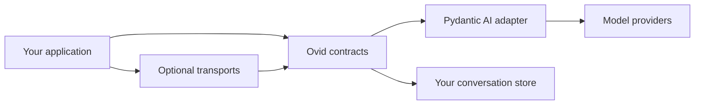

# Ovid Core

Ovid Core helps you make typed agent applications.

Define an agent one time. Then, use the agent in a script, worker, service, subprocess host, or AG-UI application.

Pydantic AI operates the model and the agent loop. Ovid Core supplies stable application interfaces around Pydantic AI.

These interfaces give you:

- Model selection and fallback routes from configuration.
- Immutable agent definitions with typed dependencies and typed output.
- Normalized messages, events, results, and usage data.
- Typed tools, toolsets, capabilities, hooks, Agent Skills, and MCP.
- Opt-in Relay messaging between application-owned agent connections.
- Common usage limits for parent agents and subagents.
- Interfaces for conversation storage and transports.
- Optional HTTP, SSE, stdio, AG-UI, and Codex subscription support.

Ovid Core is a library. It is not an application framework.

Your application controls authentication, storage, dependency construction, deployment, and telemetry export.

## Select your next topic

| Your goal | Read this topic |
| --- | --- |
| Learn why Ovid Core is different from direct Pydantic AI use | [Why Ovid Core](why-ovid-core.md) |
| Learn how the internal parts operate | [Architecture](architecture.md) |
| Select the optional parts that you need | [Components](components.md) |
| Run a small agent | [Getting started](getting-started.md) |
| Make a typed agent for an application | [Build an agent](guides/build-an-agent.md) |
| Add tools, hooks, Agent Skills, provider features, or MCP | [Extend an agent](guides/extend-an-agent.md) |
| Connect orchestrators, subagents, or peers through Relay | [Use Relay between agents](guides/use-relay.md) |
| Connect an agent to a worker, service, stdio, or AG-UI | [Embed and expose agents](guides/embed-agents.md) |
| Find exact types, fields, and signatures | [Public API](api/index.md) |

## The primary function

You can use Pydantic AI directly to make a small agent. This method is correct for many scripts.

Ovid Core helps when different application parts use the same agent.

For example, a service, worker, database, usage monitor, and user interface need common data contracts. Ovid Core supplies these contracts.

The Pydantic AI adapter contains the upstream compatibility code.



Application code uses Ovid values. These values include configuration, agent definitions, messages, events, results, usage, and extension interfaces.

Adapter code uses Pydantic AI and provider runtime objects.

## One configured agent

Define the model in `ovid.toml`:

```toml
[models.primary]
provider = "openai"
model = "gpt-5"
```

Load the configuration and build the agent:

```python
config = load_config_file(Path('ovid.toml'))
factory = AgentFactory(config=config)
agent = await factory.build(
    AgentDefinition[AppDeps, Answer](
        model=ModelRef(name='primary'),
        deps_type=AppDeps,
        output_type=Answer,
    )
)
result = await agent.run('Assess this release.', deps=deps)
```

The configuration selects the provider model. The typed definition sets the input dependencies, output contract, instructions, and optional extensions.

`AgentFactory` supplies the default model factory, router, and compiler. Applications can replace these components when necessary.

## Installation

Install the base package:

```bash
uv add ovid-core
```

Install the optional HTTP and SSE server:

```bash
uv add 'ovid-core[server]'
```

Install optional AG-UI support:

```bash
uv add 'ovid-core[server-ag-ui]'
```

The AG-UI package also installs the server dependencies.

Ovid Core requires Python 3.14 or a later version.

## Application responsibilities

Your application controls these functions:

| Function | Reason |
| --- | --- |
| Configuration sources and precedence | Each application has a different configuration policy |
| Authentication and authorization | The application owns user identity |
| Dependency construction | Each request can need different repositories and clients |
| Durable storage and retention | The application owns database and session rules |
| Deployment and process control | Ovid Core can operate in a process or through a transport |
| Relay connection lifecycle and incoming delivery | The application decides whether a message steers, wakes, starts, or remains pending for an agent |
| Telemetry export | The operator selects the destination and content policy |

These limits help you connect Ovid Core to an existing application. You do not have to change the application structure.
